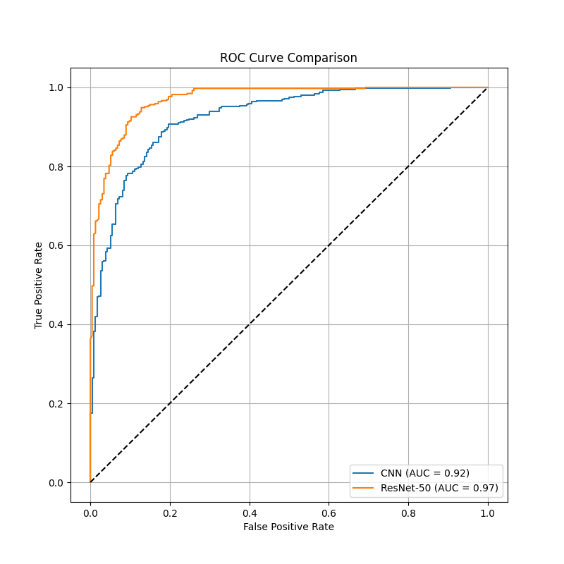

# X-Ray Image Recognition of Pneumonia Based on Machine Learning
The project is to predict normal and pneumonia by training AI models to recognize X-ray images of the lungs.This project focuses on learning how to use AI and exploring the differences between the ResNet model and the CNN model.

# Datasets resource
https://data.mendeley.com/datasets/rscbjbr9sj/2

The data set is structured as follows:

  chest_xary-------------------------
  
      test----------------------------
          NORMAL----------------
          PNEUMONIA-----------
      train------------------
          NORMAL----------------
          PNEUMONIA-----------
      val-----------------------------
          NORMAL----------------
          PNEUMONIA-----------
  

Because the data set is too large to upload, please download the data set through this link and put it in accordance with this structure. The uploaded file contains only a few images for the test run after downloading, and cannot be used as formal training.

# Running
After the decompression is complete, ensure that all files are in the same directory. 

Run **pip install -r requirements.txt** on the terminal. 

If you're not using a 30-series or 40-series graphics card, change the version of Pytorch as needed.

**train.py** is used to train the model.

**evaluate_model.py** is used to evaluate the model on test set. 

**test_model.py** randomly selects 10 images from the test set for visualization.

# Results

The best training results are stored in the compare_7 folder and the results are as follows.

|Model|Accuracy|Recall|F1 Score|
|-----|--------|------|--------|
|CNN|77.88%|71.20%|72.41%|
|ResNet-50|87.50%|87.50%|87.30%|

